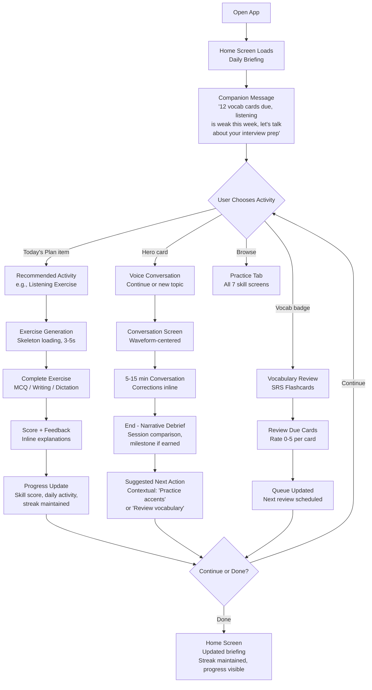
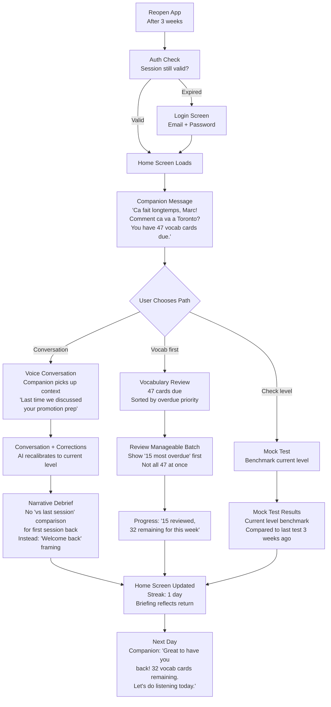
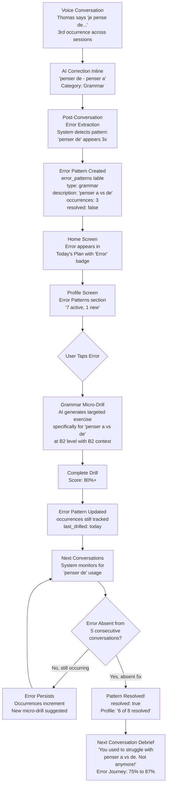

# UX Design Specification — Companion

**Author:** Simplemart
**Date:** 2026-03-24

---

## Executive Summary

### Project Vision

Companion is an AI-powered French language learning app that provides a persistent, adaptive learning partner for TCF exam preparation. Unlike gamified drill tools or content libraries, Companion builds a continuous relationship with the learner — remembering their story, tracking their weaknesses across sessions, and adapting difficulty across all TCF skill dimensions (listening, reading, writing, grammar, speaking, vocabulary, pronunciation). The core UX promise: practicing French with Companion should feel like having a patient, knowledgeable friend in Paris who never forgets where you left off.

The product is a fully implemented MVP (brownfield) targeting app store submission. UX design must formalize and refine the existing experience while establishing patterns for Phase 2+ growth features.

### Engagement Model: Progress Through Relationship

Companion deliberately avoids gamification mechanics (no XP, leaderboards, or punitive streaks). Engagement comes from four reinforcing mechanisms that deepen the user's relationship with the AI companion:

1. **CEFR advancement** — visible level progression validated by cross-skill performance
2. **Error pattern resolution** — tangible proof that specific weaknesses are being eliminated
3. **Companion memory continuity** — the AI remembers your story, goals, and context across sessions
4. **Habit-forming rituals** — post-conversation feedback, daily goals, streak tracking

This model is named "Progress Through Relationship" — the user stays because the companion knows them, not because of points.

### Target Users

**Primary audience:** Self-learners preparing for the TCF exam who lack access to a francophone environment or personal tutor.

**Primary design persona: Sofia (Immigration Applicant)** — she represents the largest addressable market, uses the broadest feature set, and exercises every major flow. Design for Sofia first, then verify the experience doesn't break for Marc, Amina, or Thomas.

| Persona                           | Profile                                  | CEFR Range | Primary Need                                       | Key UX Implication                                                       |
| --------------------------------- | ---------------------------------------- | ---------- | -------------------------------------------------- | ------------------------------------------------------------------------ |
| **Sofia** (Immigration Applicant) | 28, developer, deadline-driven           | A2 → B2    | Structured daily practice with measurable progress | Progress visibility, streak motivation, goal tracking                    |
| Marc (Returning Learner)          | 35, lapsed heritage speaker              | B1 → C1    | Zero-friction re-engagement, preserved history     | Continuity signals, memory surfacing, SRS backlog management             |
| Amina (Complete Beginner)         | 22, student, zero French                 | A1 → B1    | Patient scaffolding, not overwhelming              | Simplified flows at low levels, encouragement, gradual feature discovery |
| Thomas (Plateaued Advanced)       | 41, 5 years in France, fossilized errors | B2 → C1    | Honest correction, precision drills                | Error density, advanced feedback, no hand-holding                        |

**Common context:** Mobile-first (phone, portrait). Sessions of 15-20 minutes. Usage during commutes, lunch breaks, and dedicated study time. Tech comfort varies from intermediate to high.

### Key Design Challenges

1. **Voice conversation screen fidelity (defining challenge)** — This is the signature screen and the single hardest UX problem. It must manage: connecting state, recording state, a "processing" state (user stopped speaking, AI hasn't started), AI speaking state, live transcript scrolling, inline corrections appearing mid-conversation, and post-conversation feedback — all in a portrait phone viewport. The 500ms-2s silence between user speech and AI response is where users panic; the UX must communicate "I heard you, I'm thinking" distinctly from idle. If this screen feels effortless, the rest of the app is comparatively straightforward.

2. **Multi-modal complexity** — 7 exercise types, voice conversations, mock tests, and vocabulary SRS require distinct interaction patterns within a cohesive experience. Risk of cognitive overload, especially at lower CEFR levels.

3. **A1-to-C2 adaptive presentation** — The same UI must serve complete beginners (encouragement, simplicity) and advanced learners (density, precision) without separate design branches. Tone, content volume, and feature exposure must scale with proficiency.

4. **Loading and generation wait times** — Exercise generation takes up to 5 seconds, mock test generation longer, and voice conversation startup (WebSocket + memory retrieval + error fetch) takes 3-4 seconds. Skeleton animations help for exercises, but the voice "warming up" experience needs to feel intentional and branded, not broken.

5. **Offline transition moments** — The critical UX challenge isn't the steady offline state (SRS works fine) but the _moment of transition_: user loses connection mid-conversation (WebSocket drops), mid-exercise (API unavailable). "Connection lost — your conversation has been saved" with a clear path back to the transcript is essential. The design must handle the transition gracefully, not just the before/after.

6. **Engagement without gamification** — See "Progress Through Relationship" model above. The UX must make CEFR advancement, error resolution, and memory continuity feel as rewarding as traditional gamification — through ritual, visibility, and emotional connection.

### Design Opportunities

1. **"The companion remembers" moments** — Surfacing AI memory of personal context mid-conversation creates an emotional hook unique to this product. UX should amplify these touchpoints visually in the transcript.

2. **Error-to-mastery narrative** — Visualizing the journey from many error patterns to few resolved ones provides tangible, motivating proof of improvement beyond abstract scores. "8 patterns → 2 remaining" is a powerful progress signal.

3. **Post-conversation feedback ritual** — The fluency/grammar debrief after voice sessions is a signature interaction opportunity — a brief, satisfying reflection moment users anticipate. This is the app's equivalent of a workout summary.

4. **Home screen as personalized daily briefing** — Transform the home screen from stats + quick actions into a companion-driven briefing: "12 vocabulary cards due, your weakest skill is listening, and last time we talked about your interview in Lyon." The relationship made tangible before the user starts a session.

## Core User Experience

### Defining Experience

Companion's core experience is built on two co-equal pillars:

1. **Voice conversation with the AI companion** — The user speaks French, receives real-time corrections, and gets a post-session feedback debrief. This is the signature interaction that no competitor replicates: a patient, memory-equipped conversational partner available on demand.

2. **Practice French and get immediate, personalized feedback** — Across all exercise types (grammar, listening, reading, writing, pronunciation, dictation), the user practices a specific skill and receives AI-generated feedback calibrated to their CEFR level, informed by their error history, and delivered instantly.

These pillars are not sequential — they reinforce each other. Errors caught in conversation feed targeted exercises. Vocabulary learned in SRS review appears in conversations. The companion remembers performance across both modes. The user experiences one continuous learning relationship, not separate tools.

**Core Loop (daily):**

1. Open app → see personalized daily briefing (what to practice, what's due, companion context)
2. Engage in voice conversation OR targeted exercise (user's choice, or AI-recommended)
3. Receive immediate, personalized feedback (inline corrections, score, evaluation)
4. Review progress signals (error patterns resolved, streak maintained, skill scores updated)

**Level-Adaptive Entry:**

- A1-A2 users naturally gravitate toward structured exercises and dictation first, graduating to voice conversations as confidence builds
- B1+ users lead with voice conversations, using exercises to target specific weaknesses
- The app supports both paths without forcing either — the home screen surfaces the right next action regardless of level

### Platform Strategy

| Dimension               | Decision                                                       | Rationale                                                                              |
| ----------------------- | -------------------------------------------------------------- | -------------------------------------------------------------------------------------- |
| **Platform**            | iOS + Android (React Native / Expo)                            | Single codebase, maximum reach for global TCF audience                                 |
| **Form factor**         | Phone only, portrait                                           | Sessions are 15-20 min on commutes and breaks; phone is the primary device             |
| **Input mode**          | Voice-first + touch                                            | Voice for conversations and pronunciation; touch for exercises, navigation, text input |
| **Offline**             | Partial — SRS vocabulary offline, AI features online           | Core AI features require API; vocabulary review is the offline anchor                  |
| **Device capabilities** | Microphone (core), secure storage (auth), AsyncStorage (cache) | No camera, GPS, or other hardware needed                                               |
| **Orientation**         | Portrait locked                                                | Optimized for one-handed use during commutes                                           |

### Effortless Interactions

**Must feel zero-friction:**

- **Starting a conversation** — One tap from home screen to speaking French. Topic selection is optional, not required. The companion can pick up where you left off.
- **Receiving corrections** — Corrections appear inline in the transcript as the conversation flows. No modal, no interruption. Tap to expand for explanation.
- **Knowing what to do next** — The home screen tells you: vocabulary cards due, weakest skill to practice, companion context from last session. No decision fatigue.
- **Returning after absence** — Profile, progress, vocabulary, and companion memory all preserved. The AI greets you with continuity, not a cold start.
- **Transitioning between features** — Tapping an error pattern on profile navigates directly to a targeted micro-drill. Tapping a skill navigates to the relevant practice screen. Cross-feature navigation is contextual, not menu-driven.

**Must happen automatically:**

- Streak and daily activity tracking (no manual logging)
- Error pattern detection and tracking from conversations and exercises
- CEFR level promotion when criteria are met
- Companion memory extraction and retrieval
- Offline write queue sync on reconnection
- Cache invalidation on fresh data writes

### Critical Success Moments

| Moment                           | When It Happens                                                            | Why It Matters                                                         | If It Fails                                                                |
| -------------------------------- | -------------------------------------------------------------------------- | ---------------------------------------------------------------------- | -------------------------------------------------------------------------- |
| **"The companion knows me"**     | AI references personal context mid-conversation (city, goals, past topics) | Emotional hook — user realizes this isn't another chatbot              | User feels they're talking to a generic bot; no reason to stay vs. ChatGPT |
| **First correction that clicks** | User makes an error, sees the correction inline, understands why           | Validates the learning value — "I'm actually improving"                | Corrections feel random, unhelpful, or patronizing                         |
| **Post-conversation debrief**    | Feedback sheet with fluency/grammar ratings, strengths, improvements       | Ritual that creates reflection and anticipation for next session       | No feedback → conversation feels unstructured; user can't track growth     |
| **Error pattern resolved**       | User sees an error pattern marked resolved after consistent correct usage  | Tangible mastery proof — "I used to make this mistake and now I don't" | Errors tracked but never resolved → feels like the app only shows failures |
| **CEFR level promotion**         | Auto-promotion after 10+ exercises across 3+ skills at 85%+                | Milestone celebration — the most visible progress signal in the app    | Promotion criteria too opaque or too hard → user feels stuck               |
| **Voice conversation startup**   | Tap "Start" → connected and speaking within 3-4 seconds                    | First impression of the signature feature; sets trust for the session  | Slow, confusing, or error-prone → user abandons before speaking a word     |

### Experience Principles

1. **Relationship over transaction** — Every interaction should deepen the user's sense that the companion knows them. Memory surfacing, error continuity, and personalized feedback are not features — they are the product.

2. **Feedback is immediate, always** — Whether speaking, writing, or answering MCQs, the user never waits to know how they did. Corrections are inline, scores are instant, evaluations appear on completion. Delayed feedback breaks the learning loop.

3. **Show progress, not just scores** — A score of 78% is data. "You've resolved 6 of 8 error patterns and your grammar rating went from 2/5 to 4/5 over 3 weeks" is progress. The UX must tell the story of improvement over time.

4. **Reduce decisions, not options** — The app offers 7 exercise types, 3 conversation modes, and vocabulary review. That's a lot of choice. The UX should guide: surface the right next action on the home screen, let error patterns drive drill selection, let the companion suggest topics. Options exist but decisions are minimized.

5. **Graceful in the gaps** — Loading states, offline transitions, processing pauses, and empty states are not edge cases — they are part of the experience. Every gap should feel intentional: branded skeleton animations, "warming up" voice connection, "connection lost — your conversation is saved."

## Desired Emotional Response

### Primary Emotional Goals

| Emotional Goal            | Description                                                                                                        | When It Matters Most                                                                                                                       |
| ------------------------- | ------------------------------------------------------------------------------------------------------------------ | ------------------------------------------------------------------------------------------------------------------------------------------ |
| **Trusted companionship** | The feeling of having a dedicated partner in your corner — not a tool you use, but someone who knows you           | Throughout — this is the differentiator from every competitor                                                                              |
| **Safety to fail**        | "I can make mistakes here without judgment" — the vulnerability of speaking badly is met with patience and privacy | During voice conversations, first attempts at exercises, low scores                                                                        |
| **Growing strength**      | "I'm getting stronger, I can feel it" — the empowerment of watching measurable improvement                         | After corrections click, error patterns resolve, CEFR promotions, streak milestones                                                        |
| **Being seen**            | "It actually knows what I need" — the feeling of being understood, not generically served                          | When the companion references personal context, when exercises target real weaknesses, when the home screen surfaces the right next action |

**The differentiating emotion:** Trusted companionship. Duolingo makes you feel playfully accomplished. ChatGPT makes you feel intellectually curious. Companion makes you feel **accompanied** — like someone competent and patient is walking beside you toward a goal that matters.

### Emotional Journey Mapping

| Stage                            | Desired Emotion                 | Design Expression                                                                                                                             |
| -------------------------------- | ------------------------------- | --------------------------------------------------------------------------------------------------------------------------------------------- |
| **First open**                   | Curious + hopeful               | Clean onboarding, clear value proposition, no overwhelm — "this might actually work"                                                          |
| **Placement test**               | Honest but not harsh            | Results presented as a starting point, not a verdict — "Here's where we'll begin together"                                                    |
| **First voice conversation**     | Safe vulnerability              | Companion speaks slowly, celebrates attempts, corrections are gentle. The waveform animation feels alive but calm                             |
| **First correction that clicks** | Small thrill of insight         | Inline correction with clear explanation — the "aha" moment that validates the learning model                                                 |
| **Daily practice (routine)**     | Calm focus + quiet momentum     | Familiar ritual: open → briefing → practice → feedback. Low cognitive load, high habit reinforcement                                          |
| **Post-conversation debrief**    | Reflective satisfaction         | "That went well" or "I know what to work on" — always actionable, never punishing                                                             |
| **Bad score / failed mock test** | Honest clarity + forward motion | Blend of gentle ("This is normal at your level") and actionable ("Here are the 3 areas to focus on"). Never just comfort, never just critique |
| **Broken streak**                | Gentle re-engagement, not guilt | "Welcome back" — not "You lost your streak!" The companion picks up where you left off without punishment                                     |
| **Error pattern resolved**       | Pride + tangible mastery        | Celebration moment — "You used to struggle with de/du/des. Not anymore." Proof that the system works                                          |
| **CEFR level promotion**         | Milestone elation               | The biggest emotional peak in the app. Clear, celebratory, earned. This is the moment users screenshot and share                              |
| **Returning after weeks away**   | Relief + continuity             | Everything preserved. Companion remembers. No cold start. "Ça fait longtemps!" — the feeling of a friend welcoming you back                   |

### Micro-Emotions

**Critical emotional states to cultivate:**

- **Confidence over confusion** — The user should always know where they are, what they're doing, and what to do next. Navigation, feedback, and progress signals must eliminate ambiguity.
- **Trust over skepticism** — The AI's corrections must feel accurate, its memory must feel genuine, and its recommendations must feel relevant. One wrong correction erodes trust disproportionately.
- **Accomplishment over frustration** — Even a 40% score should feel like learning happened. The UX must frame every outcome as information ("You struggled with subjunctive — let's practice that") not as failure.
- **Belonging over isolation** — Self-study is lonely. The companion relationship must create a sense of "we're doing this together." Language choices: "Let's practice" not "Practice now." "We talked about" not "You discussed."

**Emotions to actively prevent:**

- **Overwhelm** — Too many options, too much information, too many features visible at once. Especially dangerous for A1 users.
- **Shame** — Low scores, many corrections, or failed tests must never feel like personal failure. The framing is always "this is where we focus next."
- **Abandonment** — If the AI feels generic, forgetful, or mechanical, the core value proposition dies. Every interaction should reinforce "I know you."
- **Anxiety about the exam** — The app prepares for TCF but shouldn't amplify exam stress. Mock tests are practice, not judgment. Scores are benchmarks, not verdicts.

### Design Implications

| Emotion                        | UX Design Approach                                                                                                                                                                                       |
| ------------------------------ | -------------------------------------------------------------------------------------------------------------------------------------------------------------------------------------------------------- |
| **Trusted companionship**      | First-person plural language ("Let's practice," "We've been working on..."). Companion memory surfaced visually. Consistent AI personality across all interactions                                       |
| **Safety to fail**             | Corrections appear inline without modal interruption. No red "WRONG" screens. Explanations always accompany corrections. Voice conversation has no visible timer or pressure                             |
| **Growing strength**           | Error pattern count visible on profile (8 → 2 remaining). CEFR chart shows progression over time. Post-conversation ratings tracked session-over-session. Streak as positive momentum, not obligation    |
| **Being seen**                 | Home briefing references personal context. Exercise selection informed by error history. Companion greets returning users with memory. Difficulty adapts visibly to demonstrated skill                   |
| **Honest clarity on setbacks** | Bad scores show specific areas to improve alongside encouragement. Mock test results break down by section with actionable next steps. Broken streaks met with "Welcome back" not "You lost your streak" |

### Emotional Design Principles

1. **Safe first, strong second** — In any given moment, the user must first feel safe (no judgment, no overwhelm, no shame), then feel empowered (clear next step, visible progress, growing capability). Safety enables vulnerability; vulnerability enables learning.

2. **Accompany, don't instruct** — The emotional tone is "walking beside you" not "teaching at you." Language, visual design, and interaction patterns should feel collaborative, not hierarchical. The companion is a partner, not a professor.

3. **Frame every outcome as forward motion** — A 40% score means "3 areas to focus on," not "you failed." A broken streak means "welcome back," not "streak lost." An error pattern means "let's fix this together," not "you keep making this mistake." Every data point is a direction, not a verdict.

4. **Earn the big emotions** — CEFR promotions, resolved error patterns, and conversation milestones deserve genuine celebration. Don't dilute these moments with constant small rewards. The emotional peaks are rare and earned — that's what makes them meaningful.

5. **Silence is an emotion too** — The processing pause in voice conversations, the loading state before exercises, the empty state on first use — these silences communicate. Design them to feel intentional (anticipation, preparation) not broken (lag, error).

## UX Pattern Analysis & Inspiration

### Inspiring Products Analysis

Three products provide the strongest UX inspiration for Companion, each contributing a distinct dimension:

#### Headspace — Emotional Tone & Habit Formation

Headspace makes an inherently uncomfortable activity (meditation) feel approachable and safe — the same challenge Companion faces with language learning vulnerability.

| Pattern                          | How Headspace Does It                                                                      | How Companion Adapts It                                                                                                          |
| -------------------------------- | ------------------------------------------------------------------------------------------ | -------------------------------------------------------------------------------------------------------------------------------- |
| **Curated "Today" tab**          | Single recommended session based on goals, time of day, and history — no browsing required | Home screen as personalized daily briefing: recommended next activity based on weak skills, SRS cards due, and companion context |
| **Subtle milestone celebration** | Soft glow and congratulatory message at intervals — no confetti, no noise                  | CEFR promotions and error resolutions celebrated with earned, restrained delight — not constant micro-rewards                    |
| **Context-aware tone**           | Morning warmth, evening calm, SOS mode for acute anxiety                                   | Adapt tone for returning users (gentle re-engagement), struggling users (encouragement), and advancing users (challenge)         |
| **Minimal player screen**        | Progress ring, play/pause, title — nothing else during meditation                          | Voice conversation screen strips to essentials during active speech: waveform, transcript, stop button                           |
| **Offline-first promotion**      | "Download for offline" on every session; errors redirect to cached content                 | SRS vocabulary prominently surfaced as the offline anchor; offline transition redirects to cached content, not error screens     |

#### Elsa Speak — Feedback Precision & Coaching Feel

Elsa is the closest product to Companion's pronunciation feature, with best-in-class speech feedback UX.

| Pattern                             | How Elsa Does It                                                     | How Companion Adapts It                                                                                                      |
| ----------------------------------- | -------------------------------------------------------------------- | ---------------------------------------------------------------------------------------------------------------------------- |
| **Phoneme-level color coding**      | Green/yellow/red per word after speech, tap to expand phoneme detail | Word-level accuracy visualization already implemented; validate and refine the color-coding pattern for pronunciation screen |
| **Speech assessment as onboarding** | 5-10 sentence reading that calibrates AI and creates "wow" moment    | Placement test already serves this role; ensure the first voice interaction creates a similar "it understands me" moment     |
| **Processing animation**            | Waveform "being analyzed" during 1-3s evaluation wait                | Apply to voice conversation processing gap: branded animation communicating "I heard you, I'm thinking"                      |
| **Clinical coaching tone**          | "Here's what to fix" — not gamified, not punishing                   | Matches "accompany, don't instruct" principle; corrections framed as coaching, not grading                                   |
| **Weak sounds curriculum**          | Focus sounds list that shrinks as user improves                      | Error patterns list that shrinks as patterns are resolved — same mechanic applied to grammar, vocabulary, and pronunciation  |

#### ChatGPT Voice Mode — Conversational Naturalness

The closest reference for Companion's signature voice conversation screen.

| Pattern                       | How ChatGPT Does It                                                            | How Companion Adapts It                                                                                                |
| ----------------------------- | ------------------------------------------------------------------------------ | ---------------------------------------------------------------------------------------------------------------------- |
| **Visual aura/orb**           | Abstract shape responds to speech volume, pulses gently during silence         | AudioWaveform component already serves this role; validate that idle/active/processing states are visually distinct    |
| **Interruption model**        | User can barge in mid-response; AI stops, acknowledges, pivots                 | Realtime API supports this via server VAD; ensure UX handles mid-sentence interruption gracefully in transcript        |
| **Latency masking**           | AI uses filler phrases ("Well...", "Let me think...") while generating         | Add French filler phrases ("Alors, voyons...", "Hmm, bonne question...") to system prompts to mask processing gaps     |
| **Anti-UI philosophy**        | Voice mode is full-screen with minimal controls; no distracting buttons        | Voice conversation screen should resist adding controls during active speech; minimize to waveform + transcript + stop |
| **Mode transition animation** | Chat slides down, aura fades in — clear mode switch communication              | Connecting → active → processing → AI speaking states need equally clear visual transitions                            |
| **Graceful degradation**      | Connection loss dims the aura, shows "Reconnecting..." — doesn't crash to text | "Connection lost — your conversation has been saved" with path back to transcript, not an error screen                 |

### Transferable UX Patterns

**Navigation Patterns:**

- **Single-recommendation home screen** (Headspace) — reduce the home screen from a dashboard of options to a companion-driven "here's what to do next" briefing
- **Contextual cross-navigation** (internal) — tapping an error pattern navigates to a micro-drill; tapping a skill navigates to practice. The app connects features, not just lists them

**Interaction Patterns:**

- **Inline correction without interruption** (Duolingo + Elsa) — corrections appear in the flow, never in a modal. Tap to expand for detail. The learning continues.
- **Latency masking with natural filler** (ChatGPT) — processing gaps filled with French thinking phrases, making the AI feel conversational rather than computational
- **Processing as branded moment** (Elsa) — the "analyzing your speech" animation communicates value, not delay. Apply to all generation wait times.

**Visual Patterns:**

- **Color-coded feedback at the word/phoneme level** (Elsa) — green/yellow/red per word for pronunciation; extend to dictation word comparison (already implemented) and inline conversation corrections
- **Calendar heatmap for consistency** (Strava) — daily_activity data visualized as a heatmap on profile, leveraging "fill the gaps" motivation
- **Minimal voice interface** (ChatGPT) — strip the conversation screen to essentials during active speech; add controls only when conversation is paused or ended

### Anti-Patterns to Avoid

| Anti-Pattern                          | Where It Appears                                                       | Why It Conflicts with Companion                                                                                      |
| ------------------------------------- | ---------------------------------------------------------------------- | -------------------------------------------------------------------------------------------------------------------- |
| **Punitive streak mechanics**         | Duolingo's passive-aggressive notifications, hearts system             | Conflicts with "safe first, strong second" — streaks are positive momentum, never punishment or anxiety              |
| **Gamification as core engagement**   | Duolingo's XP, leagues, gems, streak freezes                           | Conflicts with "Progress Through Relationship" — engagement comes from the companion knowing you, not from points    |
| **Social comparison / leaderboards**  | Strava's segment leaderboards, Duolingo's leagues                      | Solo self-learners don't benefit from comparison; amplifies exam anxiety rather than reducing it                     |
| **Deferred value in onboarding**      | Apps requiring 10+ minutes before first useful interaction             | The placement test and first voice conversation must feel valuable in themselves, not like gates to the real product |
| **Over-dense data visualization**     | Strava's split tables, power curves, pace charts                       | Users aren't data athletes. Progress should be narrative ("you fixed 6 of 8 errors") not statistical                 |
| **Generic AI personality**            | Basic chatbot interfaces without memory or personality                 | The companion must feel like a specific, consistent personality — not a different bot each session                   |
| **Error screens for expected states** | Apps showing error modals for offline, empty data, or slow connections | Offline, empty, and loading are expected states, not errors. Design them as part of the experience                   |

### Design Inspiration Strategy

**Adopt directly:**

- Headspace's curated "Today" recommendation as the home screen model
- Elsa's processing animation pattern for all AI generation waits
- ChatGPT's anti-UI voice screen philosophy during active conversation
- Inline correction pattern (no modals, tap to expand) from Duolingo/Elsa

**Adapt for Companion:**

- Headspace's subtle milestone celebrations → applied to CEFR promotions and error pattern resolutions
- Elsa's phoneme color coding → extended to conversation corrections and dictation comparisons
- ChatGPT's latency masking → implemented as French filler phrases in system prompts
- Strava's calendar heatmap → simplified version on profile using daily_activity data

**Avoid deliberately:**

- Any gamification mechanics (XP, gems, leagues, hearts)
- Social comparison features (leaderboards, friend rankings)
- Punitive notification copy or streak anxiety
- Dense data dashboards aimed at power users
- Generic, forgettable AI personality

## Design System Foundation

### Design System Choice

**Approach:** Custom design system built on Tailwind primitives (NativeWind v4)

This is a hybrid approach — utility-first styling framework (NativeWind/Tailwind) providing speed and consistency, with a custom token layer (`src/lib/design.ts`) and purpose-built components. No external component library (React Native Paper, Tamagui, etc.) — all components are custom to serve Companion's specific interaction needs.

### Rationale for Selection

| Factor            | Assessment                                                                    | Why This Approach Fits                                                                                                                                  |
| ----------------- | ----------------------------------------------------------------------------- | ------------------------------------------------------------------------------------------------------------------------------------------------------- |
| **Speed**         | High — Tailwind utilities enable rapid styling without StyleSheet boilerplate | Solo developer needs maximum velocity; `className` is faster than `StyleSheet.create`                                                                   |
| **Uniqueness**    | High — no shared visual DNA with other apps                                   | Companion's interactions (AudioWaveform, CorrectionBubble, TranscriptView) have no off-the-shelf equivalents; a component library would fight, not help |
| **Consistency**   | Enforced via tokens — `design.ts` centralizes all visual decisions            | Colors, typography, spacing, radii, and shadows are single-source-of-truth; no magic numbers in screens                                                 |
| **Brand control** | Full — custom theme in `tailwind.config.js`                                   | Navy/amber/off-white palette and emotional tone require precise control that component libraries constrain                                              |
| **Maintenance**   | Moderate — tokens scale well; component promotion needed over time            | Adding new screens is fast via tokens; extracting shared components from screen-level sub-components is the growth path                                 |
| **Accessibility** | Manual — no built-in a11y from a component library                            | Accessibility labels added manually across screens; WCAG contrast verified; touch targets enforced by convention                                        |

### Implementation Approach

**Current Architecture (Implemented):**

```
Design Tokens (design.ts)          Tailwind Theme (tailwind.config.js)
├── Colors (full palette)           ├── colors (primary, accent, surface, etc.)
├── Typography (7 presets)          ├── fontFamily
├── Spacing (screen, section, card) └── extend (custom values)
├── Radii (card, button, chip, hero)
├── Shadows (card, elevated)
└── Presets (card, button, hero, screen styles)
         ↓
Shared Components (src/components/)
├── common/    NetworkBanner, ErrorBoundary
├── conversation/  TranscriptView, CorrectionBubble, AudioWaveform
├── practice/  MCQCard, ScoreCard
└── profile/   CEFRProgressionChart
         ↓
Screen Sub-Components (defined in screen files)
├── ConversationCard, SmallActionCard, ActivityBar (home)
├── SkillCard, VocabularyCard (practice)
├── WordChip (pronunciation), ComparisonWord (dictation)
├── StatTile (profile), StepPill (onboarding)
└── CardItem (conversation topics)
```

**Styling Rules:**

- Static layout: NativeWind `className` — never `StyleSheet.create`
- Dynamic/computed styles: inline `style={{ }}` using `Colors`, `Typography`, `Spacing`, `Radii` from `design.ts`
- Tinted backgrounds: `skillTint(color, opacity)` utility
- Domain constants (`LEVEL_COLORS`, `SKILL_LABELS`): `src/lib/constants.ts` — not `design.ts`

### Customization Strategy

**Token Layer Evolution:**

The current token layer in `design.ts` covers the essentials. As the UX specification drives new screens and interactions, tokens should grow in these areas:

| Token Category        | Current State                                                                        | Growth Direction                                                                                                    |
| --------------------- | ------------------------------------------------------------------------------------ | ------------------------------------------------------------------------------------------------------------------- |
| **Colors**            | Full palette (primary, accent, surface, skill colors, text, grays, borders, dark bg) | Add semantic state colors (processing, connecting, offline) if current palette doesn't cover new states             |
| **Typography**        | 7 presets (screenTitle → label)                                                      | Add presets if new UI patterns emerge (e.g., companion speech bubble text, feedback rating numbers)                 |
| **Spacing**           | Screen padding, section gap, card padding                                            | Sufficient — add only if new layout patterns demand it                                                              |
| **Animation**         | Not tokenized — durations/curves defined per component                               | Consider tokenizing shared animation curves (spring stiffness, fade duration) for consistency across new components |
| **Elevation/Shadows** | Card and elevated presets                                                            | Sufficient for current depth model                                                                                  |

**Component Promotion Path:**

Screen-level sub-components should be promoted to `src/components/` when they meet either criterion:

1. **Reused across 2+ screens** — extract to shared component with props interface
2. **Complex enough to benefit from isolation** — extract for independent testing and maintenance

**Candidates for promotion** (based on current component inventory):

- `StatTile` (profile) — could be reused in home stats, mock test results, exercise summaries
- `ActivityBar` (home) — could be reused in profile weekly view
- `SkillCard` (practice) — pattern could generalize to any tappable feature card

**Design System Governance (Solo Developer):**

- New colors/typography: add to `design.ts` — never hardcode hex values or magic numbers
- New shared components: `React.memo` with named function, props interface, accessibility labels
- Code review gate: ESLint + `design.ts` imports enforced; `StyleSheet.create` usage flagged

## Defining Experience

### The One-Line Experience

**"Speak French with an AI that knows you and corrects you in real time."**

This is what users tell friends. It combines both co-equal pillars — voice conversation (the signature interaction) and personalized feedback (the companion relationship) — into a single, describable experience. No competitor delivers this: Duolingo doesn't have voice conversations with memory. ChatGPT doesn't track errors across sessions. Elsa Speak doesn't remember your goals.

### User Mental Model

**What users expect:** Something between a tutoring session and a phone call with a French friend. The mental model is "conversation" — turn-taking, natural flow, the other person reacting to _what you said_, not generic responses.

**What they bring from existing solutions:**

| Current Solution       | What Users Like                                    | What Frustrates Them                                                    | What Companion Fixes                                        |
| ---------------------- | -------------------------------------------------- | ----------------------------------------------------------------------- | ----------------------------------------------------------- |
| Duolingo               | Quick, habit-forming, clear progress               | Can't actually speak; exercises feel disconnected from real French      | Real conversation practice with progress tracking           |
| ChatGPT voice          | Natural conversation, can speak French             | No memory across sessions, no error tracking, no structure, no progress | Persistent memory, error tracking, CEFR-calibrated feedback |
| In-person tutor        | Personalized, corrects in real time, remembers you | Expensive, scheduling friction, limited availability                    | Available on demand, remembers you, fraction of the cost    |
| Language exchange apps | Real conversation practice                         | Unreliable partners, no correction consistency, no curriculum           | Reliable AI always available, consistent correction quality |

**Key mental model insight:** Users don't think "I'm using an AI language tool." They think "I'm practicing French with my companion." The UX must reinforce the _companion_ frame, not the _tool_ frame. This means: personality consistency, memory surfacing, first-person plural language ("Let's practice"), and emotional responsiveness.

### Success Criteria

**The experience succeeds when:**

| Criterion                                   | Measurable Signal                                 | Design Implication                                                          |
| ------------------------------------------- | ------------------------------------------------- | --------------------------------------------------------------------------- |
| **Feels like talking to a person**          | User speaks for 5+ minutes without breaking flow  | Minimal UI during conversation; latency masking; natural turn-taking        |
| **Corrections feel helpful, not punishing** | User taps to expand 50%+ of corrections           | Inline corrections with clear explanations; tap-to-expand pattern           |
| **User knows they improved**                | Post-conversation feedback viewed (not dismissed) | Debrief ritual with specific, actionable ratings                            |
| **Companion remembers**                     | User engages with memory-referencing moments      | Memory surfaced in greetings and mid-conversation; visible in transcript    |
| **Starting is effortless**                  | Time from home screen to speaking < 5 seconds     | One-tap conversation start; fast WebSocket connection; branded "warming up" |
| **Returning feels natural**                 | Day-2 and day-7 retention above 40%               | Companion greets with context; progress preserved; no cold start            |

**The experience fails when:**

- The processing gap feels like lag instead of thinking
- Corrections interrupt the conversational flow
- The AI feels generic (no memory, no personality)
- Starting a conversation requires too many steps or decisions
- The user doesn't know what they should work on next

### Novel UX Patterns

Companion's defining experience combines **established patterns in novel ways**:

**Established patterns (users already understand):**

- Voice call metaphor — tap to start, tap to end, turn-taking
- Chat transcript — messages appear chronologically, scrolls down
- Inline annotations — corrections appear attached to the message they reference

**Novel combinations (need subtle teaching):**

- **Live corrections during conversation** — users expect corrections _after_ a lesson (Duolingo) or _never_ (ChatGPT). Companion corrects _during_ the conversation without interrupting flow. The CorrectionBubble component must feel like a gentle margin note, not a red pen.
- **Memory-augmented conversation** — users don't expect an AI to remember personal context across sessions. The first time the companion references something from a previous conversation, it's a surprise. The UX should let this moment land naturally — no "I remembered!" fanfare, just organic reference.
- **Post-conversation feedback ritual** — no existing voice app provides a structured debrief after a conversation. This is a new pattern. The feedback sheet must feel like a natural conclusion (like a workout summary in Strava), not an unexpected quiz.
- **Processing state between turns** — voice assistants (Siri, Alexa) respond near-instantly. Companion has a 500ms-2s gap. The AudioWaveform's "processing" animation must teach users that thinking time is normal and the AI is preparing a thoughtful response, not lagging.

**Teaching strategy:** No tutorial. The patterns teach themselves through first use. The placement test and first conversation are the onboarding — the user discovers corrections, memory, and feedback by experiencing them.

### Experience Mechanics

#### 1. Initiation

```
Home Screen
├── Hero card: "Talk with Companion" (one tap)
│   ├── Optional: select topic (or companion picks up where you left off)
│   └── Optional: select mode (companion / debate / TCF simulation)
├── Alternative: daily briefing suggests "Continue your conversation about..."
└── Alternative: error pattern card → "Fix this with a conversation"
```

**Design rules:**

- Default path is ONE TAP from home to conversation
- Topic and mode selection are optional — companion has sensible defaults
- The hero card is the largest, most prominent element on home screen
- If the user has a recent conversation, the card says "Continue" not "Start"

#### 2. Connection (0-4 seconds)

```
Tap "Start" →
├── Screen transitions to conversation view (dark background)
├── AudioWaveform shows "connecting" animation (synchronized pulse)
├── System fetches in parallel:
│   ├── Companion memories for this user
│   ├── Top error patterns
│   └── Ephemeral Realtime API token
├── WebSocket connects
└── Waveform transitions to "idle" (slow breathing)
    └── Companion greets user (audio + transcript): "Bonjour Sofia! Comment ça va?"
```

**Design rules:**

- Transition to dark conversation screen is immediate — no loading screen
- The "connecting" waveform animation communicates progress, not waiting
- If connection takes > 4 seconds, show subtle text: "Setting up your conversation..."
- The companion's greeting references memory when available ("Comment va la préparation pour Montréal?")

#### 3. Conversation (active loop)

```
User speaks →
├── AudioWaveform shows "active/user" (amber bars oscillating)
├── Transcript shows user message appearing in real time
└── User stops speaking (server VAD detects silence)
    ├── AudioWaveform transitions to "processing" (distinct from idle)
    ├── AI generates response (500ms-2s)
    │   ├── Latency masking: filler phrase in audio ("Alors...")
    │   └── Transcript shows pending AI text with blinking cursor
    ├── AI speaks (audio plays)
    │   ├── AudioWaveform shows "active/ai" (white bars)
    │   └── Transcript shows AI message building
    ├── If corrections detected:
    │   └── CorrectionBubble slides in below the user's message
    │       ├── Category badge (grammar/vocabulary/register/pronunciation)
    │       ├── Original → corrected text
    │       └── Tap to expand explanation
    └── Cycle repeats
```

**Design rules:**

- User can interrupt AI mid-sentence (barge-in via VAD) — AI stops gracefully
- Corrections appear _after_ the AI responds, attached to the user's message — never interrupting the AI's turn
- Transcript auto-scrolls to latest message
- No visible timer or word count — no pressure signals during conversation
- The only controls visible during active conversation: waveform (center) + transcript (scrollable) + end button (bottom)

#### 4. Completion

```
User taps "End Conversation" →
├── Confirmation if conversation < 1 minute: "End after just [duration]?"
├── Conversation saved to database
├── System processes in parallel:
│   ├── Extract and store new memories
│   ├── Extract error patterns from corrections
│   └── Generate AI feedback summary
├── Feedback sheet slides up:
│   ├── Duration + message count
│   ├── Fluency rating (1-5 stars or visual)
│   ├── Grammar rating (1-5 stars or visual)
│   ├── Strengths: "Your use of passé composé was strong"
│   ├── Improvements: "Work on preposition agreement (à vs. de)"
│   └── Suggested next actions: "Practice grammar" / "Review vocabulary"
└── User dismisses → returns to conversation index or home
```

**Design rules:**

- Feedback sheet is the _ritual_ — it must feel like a satisfying conclusion, not an afterthought
- Processing the feedback (memory extraction, error tracking) happens invisibly — user never waits for it
- Suggested next actions link directly to relevant screens (deep links to grammar drill, vocabulary review)
- If the conversation was the user's best grammar rating yet, celebrate it: "Your best grammar score! 4/5"
- Feedback is always framed as forward motion, not judgment

## Visual Design Foundation

### Color System

**Palette Decision:** Retain the current Navy & Amber palette. It delivers the "trusted companionship" emotional goal — navy conveys authority and calm, amber adds warmth and energy without gamification overtones. The palette is already implemented consistently across the codebase via `design.ts` tokens.

**Core Palette:**

| Role        | Color      | Hex       | Usage                                                                          |
| ----------- | ---------- | --------- | ------------------------------------------------------------------------------ |
| **Primary** | Navy Blue  | `#1E3A5F` | Headers, hero cards, primary buttons, active tab indicators, section titles    |
| **Accent**  | Amber Gold | `#F5A623` | CTAs, streak indicators, waveform (user speaking), data highlights, CEFR chart |
| **Surface** | Off-White  | `#F5F5F0` | Screen backgrounds, card surfaces                                              |
| **Success** | Green      | `#34C759` | Correct answers, strengths, resolved errors, positive scores                   |
| **Error**   | Red        | `#FF3B30` | Wrong answers, improvements needed, error patterns, destructive actions        |

**Extended Palette (from `design.ts`):**

| Role           | Hex       | Usage                               |
| -------------- | --------- | ----------------------------------- |
| Text Primary   | `#1A1A1A` | Headings, body text                 |
| Text Secondary | `#666666` | Subtitles, secondary labels         |
| Text Tertiary  | `#999999` | Captions, disabled text             |
| Text on Dark   | `#FFFFFF` | Text on navy/dark backgrounds       |
| Gray Border    | `#E5E5E5` | Card borders, dividers              |
| Gray Light     | `#F0F0F0` | Subtle backgrounds, disabled states |
| Dark BG        | `#0F1B2D` | Voice conversation screen           |
| Dark Card BG   | `#1A2A3F` | Cards on dark backgrounds           |

**Skill Colors (per exercise type):**

| Skill         | Color     | Tint Usage                       |
| ------------- | --------- | -------------------------------- |
| Grammar       | `#5A7FBF` | Skill cards, progress indicators |
| Listening     | `#5AA4CF` | Skill cards, progress indicators |
| Reading       | `#7BC67E` | Skill cards, progress indicators |
| Writing       | `#CF8F5A` | Skill cards, progress indicators |
| Speaking      | `#CF5A5A` | Skill cards, progress indicators |
| Vocabulary    | `#8F5ACF` | Skill cards, progress indicators |
| Pronunciation | `#5ACFB8` | Skill cards, progress indicators |

Tinted backgrounds generated via `skillTint(color, opacity)` utility for subtle, non-competing skill differentiation.

**Semantic State Colors (to formalize):**

| State                 | Current Approach                 | Recommendation                                                |
| --------------------- | -------------------------------- | ------------------------------------------------------------- |
| Processing/Connecting | Amber at 60% opacity on waveform | Formalize as `Colors.stateProcessing` if used beyond waveform |
| Offline               | Red banner                       | Already uses `Colors.error` — sufficient                      |
| Streak active         | Amber                            | Already uses `Colors.accent` — sufficient                     |

### Typography System

**Typeface:** System font stack (`-apple-system` / `Roboto`) — no custom fonts. This ensures:

- Zero load time (no font download)
- Native feel on both iOS and Android
- Automatic accessibility scaling via Dynamic Type

**Type Scale (from `design.ts` Typography presets):**

| Preset          | Size | Weight | Usage                                      |
| --------------- | ---- | ------ | ------------------------------------------ |
| `screenTitle`   | 24px | 800    | Screen headers ("Bonjour, Sofia!")         |
| `sectionHeader` | 18px | 700    | Section dividers ("Practice Skills")       |
| `cardTitle`     | 16px | 700    | Card headings, list item titles            |
| `body`          | 15px | 400    | Primary content text                       |
| `bodySecondary` | 14px | 400    | Secondary content, descriptions            |
| `caption`       | 12px | 400    | Timestamps, metadata, small labels         |
| `label`         | 13px | 600    | Button text, chip text, tab labels         |
| `bigNumber`     | 48px | 800    | Hero stats (score circles, large counters) |
| `statNumber`    | 22px | 800    | Stat cards (streak count, percentages)     |

**Typography rules:**

- All presets defined as objects in `design.ts` — applied via inline `style` for dynamic values
- Static text styling uses NativeWind `className` with Tailwind font utilities
- No custom font files — system fonts only

### Spacing & Layout Foundation

**Spacing Scale (from `design.ts` Spacing constants):**

| Token                | Value | Usage                                         |
| -------------------- | ----- | --------------------------------------------- |
| `screenPadding`      | 20px  | Content screen horizontal padding             |
| `screenPaddingLarge` | 24px  | Auth/onboarding screens (more breathing room) |
| `sectionGap`         | 16px  | Vertical gap between sections                 |
| `cardPadding`        | 16px  | Internal card padding                         |

**Border Radii (from `design.ts` Radii constants):**

| Token        | Value | Usage                              |
| ------------ | ----- | ---------------------------------- |
| `card`       | 16px  | Cards, containers, modal sheets    |
| `button`     | 12px  | Buttons, action elements           |
| `chip`       | 8px   | Tags, skill chips, category badges |
| `heroBottom` | 28px  | Hero section bottom curve          |

**Layout Principles:**

- **Airy, not dense** — generous spacing between elements supports the calm, safe emotional tone. White space communicates "no rush."
- **Card-based composition** — primary content containers are rounded cards with subtle shadows, creating visual hierarchy without harsh borders
- **Single-column flow** — portrait phone, no grid complexity. Vertical scroll with clear section breaks.
- **Consistent rhythm** — 16px vertical gap between all sections; 20px screen padding creates a predictable visual frame

**Shadow System (from `design.ts`):**

- `Shadows.card` — subtle drop shadow for content cards
- `Shadows.elevated` — stronger shadow for floating elements (modals, sheets, hero cards)

### Accessibility Considerations

**Contrast Compliance:**

- Navy (`#1E3A5F`) on off-white (`#F5F5F0`): 8.2:1 ratio — exceeds WCAG AAA (7:1)
- White text on navy: 8.2:1 — exceeds WCAG AAA
- Amber (`#F5A623`) on navy: 4.8:1 — passes WCAG AA for large text (3:1)
- Success green on white: passes AA; error red on white: passes AA

**Touch Targets:**

- Minimum 44x44 points on all interactive elements (iOS HIG standard)
- Enforced by convention in component development

**Dynamic Type:**

- System fonts automatically scale with user's accessibility settings
- Layout tested to not break at larger font sizes (NativeWind responsive)

**Screen Reader Support:**

- `accessibilityRole`, `accessibilityLabel`, and `accessibilityHint` on interactive elements
- Radio group semantics on MCQ options
- Composite labels on score displays ("Score: 78 percent. 8 correct out of 10.")

**Color Independence:**

- Success/error states use green/red BUT also include text labels and icons — never color-only signaling
- Correction categories use color tints but also display category name text (Grammar, Vocabulary, etc.)
- Pronunciation word chips use color AND error type text

## Design Direction Decision

### Design Directions Explored

Three key screen areas were evaluated with A/B mockup comparisons, each contrasting the current implementation against an evolved direction aligned with our experience principles:

| Area                           | Option A (Current)                  | Option B (Chosen)                                             |
| ------------------------------ | ----------------------------------- | ------------------------------------------------------------- |
| **Home Screen**                | Stats dashboard + quick action grid | Companion daily briefing with personalized plan               |
| **Voice Conversation**         | Transcript-heavy, compact waveform  | Waveform-centered with processing state, condensed transcript |
| **Post-Conversation Feedback** | Score-focused debrief               | Narrative progress story with session comparison              |

### Chosen Direction

**All-B: Companion-driven, narrative, relationship-first.**

This direction consistently prioritizes the companion relationship and progress narrative over raw data display. It aligns directly with our "Progress Through Relationship" engagement model and all five experience principles.

#### Home Screen: Companion Daily Briefing

- **Companion message** with avatar — surfaces memory context ("Last time we talked about your move to Montreal"), due items, and weakest skill. The companion speaks first, establishing the relationship frame before the user takes action.
- **"Continue Our Conversation"** hero card — replaces generic "Start a conversation" with contextual continuation. Reduces decisions.
- **"Today's Plan"** — curated list of 2-3 recommended activities based on: SRS cards due, weakest skill this week, active error patterns. Each item has a contextual badge (Due, Suggested, Error). Replaces the undifferentiated skill grid.
- **Error Patterns summary** — compact progress bar showing resolved vs. active patterns (6/8 resolved). Reinforces the error-to-mastery narrative on every app open.
- **Stats deprioritized** — streak shown in status bar, CEFR level in subtitle. Not removed, but not the hero content.

#### Voice Conversation: Waveform-Centered + Processing State

- **Waveform is the visual anchor** — large, centered, with concentric ring borders. Occupies the middle of the screen during active conversation. Draws the eye to the "living" element.
- **Condensed transcript** — most recent 2-3 messages visible above the waveform, scrollable. Full transcript accessible but not dominating the screen during active speech.
- **Correction side notes** — amber-tinted left-border cards attached to user messages. "Grammar · Tap for details" pattern. Less visually heavy than the current full correction bubbles during conversation flow.
- **Distinct processing state** — "Listening..." label below the waveform when AI is processing. Visually distinct from idle (breathing) and active (oscillating). Solves the 500ms-2s anxiety gap identified in design challenges.
- **Minimal controls during speech** — waveform + condensed transcript + end button. No other UI elements competing for attention.

#### Post-Conversation Feedback: Narrative Progress Story

- **Personalized header** — "Great Session, Sofia!" instead of "Conversation Complete." Names the user, references the topic. Sets emotional tone of accomplishment.
- **Milestone celebration** — when a personal best is achieved (best fluency score, longest conversation, etc.), a celebration banner appears at the top. Earned, not constant. Implements "earn the big emotions" principle.
- **Session-over-session comparison** — fluency, grammar, and duration shown as deltas vs. last session (3/5 → 4/5). Makes progress visible and tangible. Implements "show progress, not just scores."
- **"What We Noticed"** — replaces Strengths/Improvements with companion-voiced observations. "Passé composé used correctly 4 times — pattern resolved!" frames feedback as the companion paying attention, not a grading system.
- **Error Journey progress bar** — "6 of 8 patterns resolved (75%)" with visual bar. The error-to-mastery narrative made tangible in every debrief.
- **Contextual next action** — "Practice Accents" (specific to today's errors) instead of generic "Practice Grammar." Reduces decisions, connects feedback to action.

### Design Rationale

| Principle                          | How All-B Delivers                                                                          |
| ---------------------------------- | ------------------------------------------------------------------------------------------- |
| **Relationship over transaction**  | Companion message on home, personalized feedback header, "What We Noticed" voice            |
| **Feedback is immediate, always**  | Correction side notes during conversation, session comparison on debrief                    |
| **Show progress, not just scores** | Error journey bar, session deltas, milestone celebration, pattern resolution callouts       |
| **Reduce decisions, not options**  | Today's Plan replaces undifferentiated grid, contextual next action replaces generic button |
| **Graceful in the gaps**           | Processing state with "Listening..." label, waveform as visual anchor during silence        |

### Implementation Approach

**Priority order for evolving current screens toward All-B:**

1. **Home screen → Daily Briefing** (highest impact, touches every session)
   - Add companion message component with memory retrieval
   - Replace quick actions grid with "Today's Plan" list
   - Add error patterns summary bar
   - Move stats to subtitle/status bar position

2. **Post-conversation feedback → Narrative Story** (second highest, reinforces retention)
   - Add session-over-session comparison (requires storing previous session ratings)
   - Add milestone detection logic (personal bests)
   - Reframe strengths/improvements as "What We Noticed"
   - Add error journey progress bar

3. **Voice conversation → Waveform-Centered** (most complex, requires layout restructure)
   - Restructure layout: waveform center, transcript condensed above
   - Add distinct "processing" waveform state
   - Restyle corrections as amber side notes
   - Reduce visible controls during active speech

**Reference mockups:** `_bmad-output/planning-artifacts/ux-design-directions.html`

## User Journey Flows

### Journey 1: First-Time User (Signup → First Conversation)

**Persona:** Amina (A1 beginner) / Sofia (A2 returning learner)
**Goal:** Get from download to speaking French with measurable value in under 10 minutes
**Emotional arc:** Curious → engaged → surprised ("it understands me") → motivated ("I can do this")

```mermaid
flowchart TD
    A[App Download & Open] --> B[Welcome Screen]
    B --> C[Create Account<br/>Email + Password]
    C --> D[Onboarding Step 1<br/>Select Current Level<br/>or 'I don't know']
    D --> E[Onboarding Step 2<br/>Set Learning Goal<br/>Immigration / Study / Work / Personal]
    E --> F[Onboarding Step 3<br/>Daily Time Target<br/>10 / 15 / 20 / 30 min]
    F --> G{Knows their level?}
    G -->|Selected level| H[Skip to Home]
    G -->|'I don't know'| I[Placement Test<br/>15 AI-generated questions<br/>4 competencies, A1→C2]
    I --> J[Results Screen<br/>'Here's where we'll begin together'<br/>Level assigned + mastery analysis]
    J --> H[Home Screen<br/>Daily Briefing loads]
    H --> K[Companion Message<br/>'Bienvenue! Ready for your<br/>first conversation?']
    K --> L[Hero Card<br/>'Talk with Companion'<br/>Suggested: Introducing yourself]
    L --> M[Tap 'Start Talking']
    M --> N[Conversation Screen<br/>Connecting animation]
    N --> O[Companion Greets<br/>'Bonjour! Comment tu t'appelles?']
    O --> P[User Speaks French<br/>First attempt, any quality]
    P --> Q[AI Responds + First Correction<br/>Inline, gentle, with explanation]
    Q --> R[Aha Moment<br/>User sees correction, understands why]
    R --> S[Continue 3-5 minutes]
    S --> T[End Conversation]
    T --> U[Feedback Debrief<br/>'Great first session!'<br/>Fluency 2/5, Grammar 2/5<br/>+ encouragement]
    U --> V[Suggested Next Action<br/>'Practice vocabulary' or 'Try another conversation']
    V --> W[Home Screen<br/>Streak: 1 day<br/>First data in daily briefing]
```



**Critical design decisions:**

- Account creation before placement test (need to save results)
- Placement test framed as "let's find your starting point" not "test your French"
- First conversation topic pre-selected ("Introducing yourself") to reduce decision fatigue
- AI speaks slowly at A1-A2, celebrates attempts
- First correction is the make-or-break moment — must feel helpful, not punishing
- Feedback debrief uses encouragement-first framing for first session

**Error recovery:**

- Placement test can be retaken from profile settings
- If first conversation fails to connect (network), redirect to grammar exercise as alternative first experience
- If user abandons during onboarding, resume from last completed step on next open

### Journey 2: Daily Practice Loop (Core Retention)

**Persona:** Sofia (A2, day 14, established habit)
**Goal:** Complete a satisfying 15-20 minute practice session with measurable progress
**Emotional arc:** Familiar comfort → focused engagement → reflective satisfaction → quiet momentum



**Critical design decisions:**

- Home screen opens with companion briefing, not a dashboard — the relationship starts before the activity
- "Today's Plan" reduces choice to 2-3 curated items, each with clear rationale (Due, Suggested, Error)
- User can always override and browse all skills — options exist but decisions are minimized
- Every activity ends with a suggested next action to maintain flow
- Multiple activities in one session are supported via the loop back to "Continue or Done?"
- Streak and daily activity update automatically — no manual logging

**Session pacing:**

- Vocabulary review: 3-5 minutes (quick, offline-capable)
- Single exercise: 5-8 minutes (generation + completion + feedback)
- Voice conversation: 5-15 minutes (user-controlled duration)
- Typical session: 1 conversation + 1 exercise OR vocabulary + 2 exercises = 15-20 minutes

### Journey 3: Returning After Absence (Re-engagement)

**Persona:** Marc (B1, returning after 3 weeks away)
**Goal:** Resume practice without friction, feeling that nothing was lost
**Emotional arc:** Apprehensive → relieved ("it remembers me") → re-engaged → momentum restored



**Critical design decisions:**

- **No punishment for absence** — streak resets silently to 1, no "You lost your streak!" message. Companion says "Welcome back" not "Where have you been?"
- **Memory continuity is the hook** — companion remembers Marc's city, job context, and last conversation topic. This is the moment that proves the product is different.
- **SRS backlog management** — 47 due cards is overwhelming. Show "15 most overdue" as a manageable batch, with progress toward clearing the backlog ("15 reviewed, 32 remaining this week")
- **No session comparison on first return** — the debrief skips "vs. last session" since last session was weeks ago. Instead: "Welcome back! Here's how it went."
- **Preserved progress** — profile, skill scores, CEFR level, vocabulary, conversation history all intact. Cached data loads instantly from AsyncStorage.

**Error recovery:**

- If session expired, login preserves all data — no account reset
- If cached data is stale (>4h TTL), fetch fresh but show stale cache immediately while loading
- If user feels level has dropped, mock test available to re-benchmark

### Journey 4: Error Resolution (Closed-Loop Correction)

**Persona:** Thomas (B2, fossilized "penser de" error)
**Goal:** Identify, drill, and verify resolution of a recurring error pattern
**Emotional arc:** Unaware → aware ("I keep making this mistake") → practiced → mastered ("I don't make this mistake anymore")



**Critical design decisions:**

- **Detection is automatic** — user doesn't manually log errors. The system detects patterns from conversation corrections (3+ occurrences = pattern)
- **Drills are targeted** — not generic grammar exercises. AI generates exercises specifically about the error at the user's CEFR level with age/context-appropriate content
- **Resolution requires proof** — error must be absent from 5 consecutive conversations to be marked resolved. Not just "did the drill" but "stopped making the mistake"
- **Celebration is earned** — resolution appears in conversation debrief as a milestone. "You used to struggle with this. Not anymore." The biggest emotional payoff in the error system.
- **Error Journey progress bar** — visible on home (Today's Plan) and profile. "6 of 8 resolved (75%)" gives tangible mastery proof.

**Error recovery:**

- If error recurs after resolution, pattern reopens with a note: "This pattern came back — let's practice again"
- If user never taps the error drill, it stays in Today's Plan with increasing frequency until addressed
- Error patterns pruned after 6 months of inactivity (cleanup_stale_data function)

### Journey Patterns

**Cross-journey patterns to standardize:**

| Pattern                     | Description                                                                                                             | Used In          |
| --------------------------- | ----------------------------------------------------------------------------------------------------------------------- | ---------------- |
| **Companion-first framing** | Every journey starts with the companion speaking — greeting, context, suggestion — before the user acts                 | All 4 journeys   |
| **Contextual next action**  | Every activity ending suggests a specific next step based on what just happened, not a generic menu                     | Journeys 1, 2, 4 |
| **Progressive disclosure**  | Information revealed as needed: SRS shows 15 of 47 cards, Today's Plan shows 2-3 of 7 skills, corrections expand on tap | Journeys 2, 3    |
| **Automatic tracking**      | Streaks, errors, skill scores, daily activity all update without user input                                             | All 4 journeys   |
| **No-punishment return**    | Absence is met with "welcome back" + preserved state, never with loss messaging                                         | Journey 3        |
| **Earned celebration**      | Milestones (personal bests, resolved errors, CEFR promotion) celebrated only when genuinely achieved                    | Journeys 2, 4    |
| **Graceful degradation**    | Network failure redirects to offline capability (vocab review) rather than error screen                                 | Journeys 1, 2, 3 |

### Flow Optimization Principles

1. **One tap to core value** — from home screen to speaking French or starting an exercise in one tap. Topic/mode selection is optional, not required.

2. **Curate, don't list** — Today's Plan shows 2-3 items with rationale, not 7 undifferentiated skill buttons. Reduce the user's decision space.

3. **Loop back, don't dead-end** — every activity ending offers a contextual next step. The user is never left on a "done" screen without a clear path forward.

4. **Invisible infrastructure** — error detection, memory extraction, streak tracking, SRS scheduling, and CEFR promotion all happen automatically. The user sees results, not machinery.

5. **Frame for the moment** — first session gets encouragement framing, return after absence gets "welcome back" framing, daily practice gets "keep going" framing. Same data, different emotional context.

## Component Strategy

### Design System Components

**Existing shared components (implemented in `src/components/`):**

| Component            | Domain       | Status      | All-B Impact                                                           |
| -------------------- | ------------ | ----------- | ---------------------------------------------------------------------- |
| TranscriptView       | conversation | Implemented | Needs layout restructure — condensed mode for waveform-centered design |
| CorrectionBubble     | conversation | Implemented | Restyle as amber side-note cards with "Tap for details" pattern        |
| AudioWaveform        | conversation | Implemented | Add distinct "processing" state; increase visual prominence            |
| MCQCard              | practice     | Implemented | No changes needed                                                      |
| ScoreCard            | practice     | Implemented | No changes needed                                                      |
| CEFRProgressionChart | profile      | Implemented | No changes needed                                                      |
| NetworkBanner        | common       | Implemented | No changes needed                                                      |
| ErrorBoundary        | common       | Implemented | No changes needed                                                      |

**Screen-level sub-components to promote to shared:**

| Component   | Current Location   | Promotion Rationale                                           |
| ----------- | ------------------ | ------------------------------------------------------------- |
| StatTile    | profile/index.tsx  | Reusable in home stats, mock test results, exercise summaries |
| ActivityBar | home/index.tsx     | Reusable in profile weekly view                               |
| SkillCard   | practice/index.tsx | Generalizable to any tappable feature card pattern            |

### Custom Components

#### CompanionMessage

**Purpose:** Displays the companion's personalized briefing on the home screen — the first thing the user sees, establishing the relationship frame before any action.

**Anatomy:**

```
+-------------------------------------+
|  +--+  Your Companion               |
|  |C |  You have 12 vocabulary cards  |
|  +--+  due and your listening is     |
|        weak this week. Last time we  |
|        talked about Montreal!        |
+-------------------------------------+
```

**Props:**

- `message: string` — companion-generated briefing text (assembled from memory, SRS due count, weakest skill)
- `userName?: string` — optional for personalized greeting variant

**States:**

- Default: avatar + message rendered
- Loading: skeleton placeholder matching message card dimensions
- Empty: hidden (returns null if no message content available)

**Styling:**

- Background: `Colors.primary` at 5% opacity
- Avatar: 32px circle, `Colors.primary` background, white "C" initial
- Name: `Typography.caption`, `Colors.primary`, weight 700
- Message: `Typography.bodySecondary`, `Colors.textPrimary`
- Bold spans for key data points (card counts, skill names)
- Border radius: `Radii.card` (16px)
- Padding: `Spacing.cardPadding` (16px)

**Accessibility:**

- `accessibilityRole="text"`
- `accessibilityLabel="Your companion says: [message content]"`

#### TodayPlanItem

**Purpose:** A curated activity recommendation in the "Today's Plan" list on the home screen. Each item explains _why_ this activity is suggested.

**Anatomy:**

```
+-------------------------------------------+
|  +----+  Listening Practice    [Suggested] |
|  | h  |  Your weakest skill —              |
|  +----+  let's strengthen it               |
+-------------------------------------------+
```

**Props:**

- `icon: string` — emoji identifier for the activity
- `iconColor: string` — skill color for the icon background tint
- `title: string` — activity name
- `subtitle: string` — contextual rationale
- `badge: { text: string, type: 'due' | 'suggested' | 'error' }` — status badge
- `onPress: () => void` — navigation to relevant screen

**States:**

- Default: idle card
- Pressed: scale down to 0.97 + opacity 0.8 (haptic light)
- Disabled: opacity 0.5, non-tappable (if network required and offline)

**Badge variants:**

- `due`: amber background tint, amber text — SRS cards, scheduled reviews
- `suggested`: amber background tint, amber text — AI-recommended activities
- `error`: red background tint, red text — active error patterns needing drills

**Styling:**

- Background: `skillTint(iconColor, 0.06)`
- Icon container: 28px rounded square, `skillTint(iconColor, 0.12)`
- Title: `Typography.label`, skill color
- Subtitle: `Typography.caption`, `Colors.textSecondary`
- Badge: 6px border radius, tinted background, weight 700, size 10px
- Overall border radius: `Radii.button` (12px)
- Padding: 10px 12px

**Accessibility:**

- `accessibilityRole="button"`
- `accessibilityLabel="[title]. [subtitle]. Status: [badge text]"`
- `accessibilityHint="Double tap to start this activity"`

#### ErrorJourneyBar

**Purpose:** Compact visualization of the error-to-mastery narrative — how many error patterns are resolved out of total. Used on home screen, profile, and post-conversation feedback.

**Anatomy:**

```
+-------------------------------------+
|  6 of 8 patterns resolved      75%  |
|  ==================--------         |
+-------------------------------------+
```

**Props:**

- `resolved: number` — count of resolved patterns
- `total: number` — total pattern count
- `compact?: boolean` — smaller variant for inline use (default: false)

**States:**

- Default: bar with fill proportional to resolved/total
- Empty: hidden (returns null if total === 0)
- Complete: bar fully filled, green color, "All patterns resolved!" text

**Styling:**

- Background: `Colors.primary` at 4% opacity
- Label: `Typography.caption`, weight 600, `Colors.primary`
- Percentage: `Typography.caption`, weight 700, `Colors.success`
- Bar track: `Colors.primary` at 8% opacity, 6px height, `Radii.chip` radius
- Bar fill: `Colors.success`, animated width transition
- Padding: 8px 10px
- Border radius: `Radii.button` (12px)

**Accessibility:**

- `accessibilityRole="progressbar"`
- `accessibilityLabel="Error patterns: [resolved] of [total] resolved, [percentage] percent"`
- `accessibilityValue={{ min: 0, max: total, now: resolved }}`

#### SessionComparison

**Purpose:** "vs. Last Session" card showing metric deltas between current and previous conversation. Makes progress tangible session-over-session.

**Anatomy:**

```
+-------------------------------------+
|  vs. Last Session                    |
|  Fluency     3/5  up   4/5          |
|  Grammar     3/5  same 3/5          |
|  Duration    5m   up   8m           |
+-------------------------------------+
```

**Props:**

- `metrics: Array<{ label: string, previous: string, current: string, direction: 'up' | 'down' | 'same' }>`

**States:**

- Default: comparison rows rendered
- Empty: hidden (returns null if no previous session data exists — e.g., first conversation)
- First return: hidden (skipped when returning after long absence per Journey 3 design)

**Styling:**

- Background: `Colors.primary` at 4% opacity
- Title: `Typography.caption`, weight 700, `Colors.primary`
- Metric label: `Typography.caption`, `Colors.textSecondary`
- Previous value: `Typography.caption`, `Colors.textTertiary`
- Arrow up: `Colors.success`; arrow down: `Colors.error`; equals: `Colors.textTertiary`
- Current value: `Typography.bodySecondary`, weight 700, color matches direction
- Border radius: `Radii.button` (12px)
- Padding: 10px 12px

**Accessibility:**

- `accessibilityRole="summary"`
- Each row: `accessibilityLabel="[label]: changed from [previous] to [current], [direction]"`

#### MilestoneBanner

**Purpose:** Celebration card for earned achievements — personal bests, resolved error patterns, CEFR promotions. Appears conditionally at the top of the feedback screen.

**Anatomy:**

```
+-------------------------------------+
|  *  New Personal Best!              |
|     Your best fluency score: 4/5    |
+-------------------------------------+
```

**Props:**

- `icon: string` — celebration emoji
- `title: string` — milestone name
- `subtitle: string` — milestone detail
- `type: 'personal_best' | 'error_resolved' | 'cefr_promotion'`

**States:**

- Default: rendered with slide-in animation (Reanimated FadeInDown)
- Not earned: hidden (returns null — never shown without genuine achievement)

**Type variants:**

- `personal_best`: green tint background, green text
- `error_resolved`: green tint background, green text
- `cefr_promotion`: amber tint background, amber text (the biggest celebration)

**Styling:**

- Background: type-dependent tint at 8% opacity
- Icon: 22px font size
- Title: `Typography.label`, type-dependent color, weight 700
- Subtitle: `Typography.caption`, slightly darker type-dependent color
- Border radius: `Radii.button` (12px)
- Padding: 10px 14px
- Entry animation: `FadeInDown.duration(400).springify()`
- Haptic: `hapticSuccess()` on mount

**Accessibility:**

- `accessibilityRole="alert"`
- `accessibilityLabel="Milestone: [title]. [subtitle]"`

#### ProcessingIndicator

**Purpose:** Visual feedback during the 500ms-2s gap between user finishing speech and AI starting to respond. Communicates "I heard you, I'm thinking" distinctly from idle state.

**Props:**

- `state: 'idle' | 'processing' | 'connecting'`
- `label?: string` — override default label text

**States:**

- `idle`: hidden or minimal breathing animation (handled by AudioWaveform)
- `processing`: three pulsing dots with "Listening..." label, semi-transparent
- `connecting`: "Setting up your conversation..." label

**Styling:**

- Label: `Typography.caption`, `Colors.textOnDark` at 50% opacity, weight 500
- Dots: 5px circles, `Colors.accent` at varying opacity, staggered 200ms pulse animation
- Positioned below the AudioWaveform center
- Fade in/out transitions (Reanimated FadeIn/FadeOut, 200ms)

**Accessibility:**

- `accessibilityRole="status"`
- `accessibilityLabel="[state]: [label text]"`
- `accessibilityLiveRegion="polite"` — announces state changes to screen readers

### Component Implementation Strategy

**Build approach:**

- All new components follow existing conventions: `React.memo` with named function, props interface, `design.ts` tokens
- Placed in `src/components/` organized by domain:
  - `src/components/common/` — ErrorJourneyBar, MilestoneBanner, ProcessingIndicator
  - `src/components/home/` — CompanionMessage, TodayPlanItem (new directory)
  - `src/components/feedback/` — SessionComparison (new directory)

**Modification approach for existing components:**

- TranscriptView: add `condensed` prop for waveform-centered layout (shows last 2-3 messages only)
- CorrectionBubble: add `sideNote` variant with amber left-border styling and "Tap for details" affordance
- AudioWaveform: add `processing` state to the `speaker` prop enum

### Implementation Roadmap

**Phase 1 — Home Screen Evolution (highest impact):**

| Component        | Priority | Dependency                                                    |
| ---------------- | -------- | ------------------------------------------------------------- |
| CompanionMessage | P0       | Requires memory retrieval, SRS due count, weakest skill query |
| TodayPlanItem    | P0       | Requires activity recommendation logic                        |
| ErrorJourneyBar  | P0       | Reads from existing error_patterns table                      |

**Phase 2 — Feedback Screen Evolution:**

| Component               | Priority | Dependency                                                           |
| ----------------------- | -------- | -------------------------------------------------------------------- |
| SessionComparison       | P1       | Requires storing previous session ratings (schema addition or query) |
| MilestoneBanner         | P1       | Requires personal best detection logic                               |
| ErrorJourneyBar (reuse) | P1       | Already built in Phase 1                                             |

**Phase 3 — Conversation Screen Evolution:**

| Component                         | Priority | Dependency                                  |
| --------------------------------- | -------- | ------------------------------------------- |
| ProcessingIndicator               | P1       | Integrates with AudioWaveform state machine |
| TranscriptView condensed mode     | P2       | Layout restructure of conversation screen   |
| CorrectionBubble sideNote variant | P2       | Styling change, no logic change             |

**Phase 4 — Component Promotion:**

| Component   | Priority | Promotion From                               |
| ----------- | -------- | -------------------------------------------- |
| StatTile    | P2       | profile/index.tsx to src/components/common/  |
| ActivityBar | P2       | home/index.tsx to src/components/common/     |
| SkillCard   | P3       | practice/index.tsx to src/components/common/ |

## UX Consistency Patterns

### Loading & Generation States

Every AI-powered feature in Companion has a generation wait. These waits must feel intentional, not broken.

| Context                        | Duration | Pattern                                   | Visual                                                                 |
| ------------------------------ | -------- | ----------------------------------------- | ---------------------------------------------------------------------- |
| **Exercise generation**        | 3-5s     | Skeleton loading matching exercise layout | Content-shaped placeholders pulse with subtle animation                |
| **Mock test generation**       | 5-10s    | Skeleton + progress message               | "Generating your test..." with cycling messages about what's happening |
| **Voice conversation startup** | 2-4s     | AudioWaveform "connecting" state          | Synchronized bar pulse + concentric ring animation                     |
| **Voice processing gap**       | 0.5-2s   | ProcessingIndicator "Listening..."        | Three pulsing dots below waveform, distinct from idle                  |
| **TTS playback loading**       | 1-3s     | Inline spinner on play button             | Play button replaced with small activity indicator                     |
| **Pronunciation assessment**   | 1-3s     | Waveform "analyzing" animation            | "Analyzing your speech..." with waveform visualization                 |
| **Profile/skills loading**     | <500ms   | Cached data instant, fresh fetch silent   | Show cached immediately; replace silently when fresh data arrives      |
| **Placement test loading**     | 3-5s     | Skeleton question card                    | Matches MCQ card layout so transition is seamless                      |

**Rules:**

- Never show a generic spinner — every loading state matches the shape of the content it's replacing
- Skeleton animations use `Colors.grayLight` pulsing at 1.2s cycle
- If loading exceeds expected duration by 2x, show a subtle text message ("Taking a bit longer...")
- Cached data loads instantly from AsyncStorage; network fetch updates silently in the background
- Voice conversation uses branded "connecting" waveform, not a loading indicator

### Feedback Patterns

Feedback is the core learning mechanism. Every piece of feedback follows the same emotional framework: **acknowledge, inform, direct**.

#### Inline Corrections (during conversation)

| Element            | Design                                                               |
| ------------------ | -------------------------------------------------------------------- |
| **Trigger**        | AI detects error in user speech                                      |
| **Placement**      | Attached below the user's message bubble as a side-note card         |
| **Default state**  | Collapsed: category badge + "original to corrected" one-liner        |
| **Expanded state** | Tap to reveal full explanation paragraph                             |
| **Styling**        | Amber left-border, semi-transparent background, `Typography.caption` |
| **Animation**      | Slide-in from left, 200ms, after AI response completes               |
| **Emotion**        | "Here's a note" — not "you made a mistake"                           |

#### Exercise Score Feedback

| Score Range | Label              | Color            | Framing                                                  |
| ----------- | ------------------ | ---------------- | -------------------------------------------------------- |
| 90-100%     | "Excellent!"       | `Colors.success` | Celebrate: "Outstanding performance"                     |
| 80-89%      | "Great job!"       | `Colors.success` | Affirm: "Strong understanding"                           |
| 70-79%      | "Good work!"       | `Colors.accent`  | Encourage: "Solid progress"                              |
| 60-69%      | "Keep going!"      | `Colors.accent`  | Guide: "You're getting there — focus on [specific area]" |
| 50-59%      | "Almost there!"    | `Colors.primary` | Support: "Let's practice [specific weakness]"            |
| Below 50%   | "Keep practicing!" | `Colors.primary` | Forward: "Here's what to work on next"                   |

**Rules:**

- Never use "Failed," "Wrong," or "Poor" — always forward-looking language
- Always accompany the score with a specific, actionable insight
- Haptic feedback: `hapticSuccess()` for 80%+, `hapticLight()` for all others — never `hapticError()`
- ScoreCard always shows a "Try Again" + "Back" action pair

#### Post-Conversation Narrative Feedback

| Element           | Pattern                                                                                   |
| ----------------- | ----------------------------------------------------------------------------------------- |
| **Header**        | Personalized: "Great Session, [Name]!" — never generic "Session Complete"                 |
| **Milestone**     | MilestoneBanner at top if earned — conditional, not constant                              |
| **Ratings**       | Fluency + Grammar as bar charts with numeric values                                       |
| **Comparison**    | SessionComparison vs. last session — hidden on first session or return after long absence |
| **Observations**  | "What We Noticed" — companion-voiced, specific. Pattern resolutions celebrated.           |
| **Error Journey** | ErrorJourneyBar — always visible if error patterns exist                                  |
| **Next action**   | Contextual button based on today's weaknesses, not generic "Practice"                     |

#### Toast/Alert Patterns

| Type               | When                                          | Visual                                          | Duration                              |
| ------------------ | --------------------------------------------- | ----------------------------------------------- | ------------------------------------- |
| **Success toast**  | Exercise saved, streak updated, data exported | Green left border, check icon, one-line message | 3 seconds, auto-dismiss               |
| **Warning toast**  | Approaching rate limit, large SRS backlog     | Amber left border, info icon                    | 5 seconds, auto-dismiss               |
| **Error toast**    | API failure, save failed                      | Red left border, warning icon, retry action     | Persistent until dismissed or retried |
| **Offline banner** | Network lost                                  | Full-width red bar at top (NetworkBanner)       | Persistent until reconnected          |

**Rules:**

- Toasts appear at the top of the screen, below the status bar
- Maximum one toast visible at a time (queue if multiple)
- Error toasts always include an action (Retry or Dismiss)
- Success toasts use `hapticSuccess()`; errors use `hapticError()`

### Navigation & Transition Patterns

#### Tab Navigation

| Pattern              | Design                                                                                                         |
| -------------------- | -------------------------------------------------------------------------------------------------------------- |
| **Structure**        | 5 tabs: Home, Talk, Practice, Mock Test, Profile                                                               |
| **Active indicator** | Tab icon + label in `Colors.primary`; inactive in `Colors.textTertiary`                                        |
| **Transition**       | Instant swap — no animation between tab roots                                                                  |
| **Deep state**       | Each tab maintains its own navigation stack; switching tabs preserves position                                 |
| **Badge**            | Amber dot on Talk tab if companion has context from recent activity; number badge on Practice if SRS cards due |

#### Screen Transitions

| Transition         | Animation                                 | When                                                          |
| ------------------ | ----------------------------------------- | ------------------------------------------------------------- |
| **Push (forward)** | Slide in from right (default Expo Router) | Navigating deeper: home to conversation, practice to exercise |
| **Pop (back)**     | Slide out to right                        | Back button, swipe-back gesture                               |
| **Modal (sheet)**  | Slide up from bottom                      | Feedback debrief, confirmation dialogs, settings changes      |
| **Replace**        | Fade crossfade, 200ms                     | Auth state change (login to home), onboarding complete        |

#### Contextual Cross-Navigation

| From                        | To                    | Trigger           | Pattern                                |
| --------------------------- | --------------------- | ----------------- | -------------------------------------- |
| Profile error pattern       | Grammar micro-drill   | Tap error item    | Push with error context as route param |
| Profile skill card          | Practice skill screen | Tap skill         | Push to relevant practice screen       |
| Feedback "Practice Accents" | Pronunciation screen  | Tap action button | Push with suggested focus              |
| Home "Today's Plan" item    | Relevant screen       | Tap plan item     | Push to skill/vocab/error drill        |
| Conversation correction     | (Expand in-place)     | Tap correction    | Expand/collapse, no navigation         |

**Rules:**

- Cross-navigation always passes context (error params, skill type, topic) so the destination is pre-configured
- Back button always returns to the originating screen, not the tab root
- No circular navigation — if A pushed to B, B's back goes to A, not somewhere else

### Empty States

Every screen has a first-time state where no data exists. Empty states must feel inviting, not broken.

| Screen                   | Empty State                                                   | Message Tone                             | Action                                                             |
| ------------------------ | ------------------------------------------------------------- | ---------------------------------------- | ------------------------------------------------------------------ |
| **Home (first open)**    | Companion greets: "Welcome! Let's start with a conversation." | Warm invitation                          | "Start Your First Conversation" button                             |
| **Home (no errors)**     | Error Patterns section hidden                                 | N/A — don't show empty error section     | Section simply not rendered                                        |
| **Home (no activity)**   | Weekly activity bars at zero height                           | Quiet — no "you haven't practiced" shame | Bars present but empty; fill as activity happens                   |
| **Conversation history** | "No conversations yet"                                        | Encouraging                              | "Start your first conversation" link                               |
| **Vocabulary**           | "No vocabulary yet"                                           | Informative                              | "Words from your conversations will appear here"                   |
| **Mock test results**    | "No tests taken yet"                                          | Low pressure                             | "Take a practice test when you're ready"                           |
| **Profile skills**       | All skills at 0%                                              | Starting point, not failure              | "Complete exercises to build your skill profile"                   |
| **Profile CEFR chart**   | Single data point (current level)                             | "This is where your journey begins"      | Chart shows one dot with "Complete exercises to see your progress" |

**Rules:**

- Never use "No data," "Empty," or "Nothing here" — always contextual language
- Empty states for optional features (mock tests, vocabulary) use low-pressure "when you're ready" framing
- Empty states for core features (conversations, exercises) include a direct action to start
- First-time empty states are distinct from "had data, now empty" states (e.g., all errors resolved = celebration, not empty)

### Confirmation & Destructive Action Patterns

| Action                              | Severity | Pattern                              | Confirmation                                                                              |
| ----------------------------------- | -------- | ------------------------------------ | ----------------------------------------------------------------------------------------- |
| **End conversation (<1 min)**       | Low      | Bottom sheet                         | "End after just [duration]? Your conversation will be saved." Yes/Cancel                  |
| **End conversation (>1 min)**       | None     | Immediate                            | Conversation saved automatically, proceed to feedback                                     |
| **Submit mock test**                | Medium   | Alert dialog                         | "Submit your test? You have [N] unanswered questions." Submit/Continue                    |
| **Back during active conversation** | Low      | Bottom sheet                         | "Leave this conversation? It will be saved and you can review the transcript." Leave/Stay |
| **Back during mock test**           | Medium   | Alert dialog                         | "Leave this test? Your progress is saved and you can resume later." Leave/Stay            |
| **Change CEFR level/goal**          | Medium   | Confirmation dialog                  | "Change your target level to [X]? This affects exercise difficulty." Confirm/Cancel       |
| **Delete account**                  | Critical | Two-step: dialog + type confirmation | Step 1: "This will permanently delete all your data." Step 2: "Type DELETE to confirm."   |
| **Export data**                     | Low      | Immediate with toast                 | No confirmation needed; success toast when complete                                       |
| **New writing task**                | Low      | Confirmation if text >20 chars       | "Start a new task? Your current writing will be lost." New Task/Keep Writing              |

**Rules:**

- Low severity: bottom sheet with two options
- Medium severity: centered alert dialog with clear consequence description
- Critical severity: multi-step confirmation with explicit text input
- Never ask for confirmation on routine actions (starting exercises, rating vocab, tapping corrections)
- Confirmation dialogs use first-person plural: "Your conversation will be saved" not "The conversation will be deleted"
- Cancel/Stay is always the visually prominent option (primary color); destructive action is secondary

### Offline & Error State Patterns

#### Network Transitions

| Transition                      | UX Response                                                                                                                     | Timing                                    |
| ------------------------------- | ------------------------------------------------------------------------------------------------------------------------------- | ----------------------------------------- |
| **Go offline (steady)**         | NetworkBanner appears: "No internet connection"                                                                                 | Within 2 seconds of connectivity loss     |
| **Go offline mid-conversation** | WebSocket drops: "Connection lost — your conversation has been saved" then navigate to transcript view                          | Immediate on WebSocket close              |
| **Go offline mid-exercise**     | If exercise already generated: continue answering. If generating: "Can't generate exercise offline. Review vocabulary instead?" | Immediate                                 |
| **Come back online**            | NetworkBanner dismisses, write queue flushes automatically                                                                      | Within 2 seconds of connectivity restored |
| **Flaky connection**            | No rapid banner toggling — debounce 5 seconds before showing/hiding                                                             | Prevents visual noise                     |

#### API Error Responses

| Error Type                  | User Message                                                | Action                                            |
| --------------------------- | ----------------------------------------------------------- | ------------------------------------------------- |
| **Rate limited**            | "You're practicing fast! Take a short break and try again." | Auto-retry after cooldown timer shown             |
| **AI generation failed**    | "Couldn't generate the exercise. Let's try again."          | Retry button + Back button                        |
| **Auth expired**            | Silent redirect to login                                    | No error shown; login preserves navigation intent |
| **Server error (500)**      | "Something went wrong on our end. Try again in a moment."   | Retry button                                      |
| **Audio permission denied** | "Companion needs microphone access for conversations."      | "Open Settings" button                            |

**Rules:**

- Never show raw error codes or technical messages to users
- Every error state includes at least one action (Retry, Back, Open Settings, or Review Vocabulary as offline fallback)
- API errors in Edge Functions return structured error codes (`AUTH_MISSING`, `UPSTREAM_ERROR`, etc.) — the client maps these to human-friendly messages
- Errors during critical flows (conversation, mock test) always preserve user data before showing the error
- Error toasts use `captureError()` to log to Sentry before showing the user-facing message

#### Session Expiry

| Scenario                         | UX Response                                                                                                                             |
| -------------------------------- | --------------------------------------------------------------------------------------------------------------------------------------- |
| **Token expires during app use** | Silent refresh attempt. If refresh fails: redirect to login, preserve last screen intent. On re-login, navigate back to where user was. |
| **Token expired on app open**    | Show login screen. On successful login, go to home (not last screen — stale context).                                                   |

**Rules:**

- Session expiry never causes data loss
- The user should never see a "session expired" error — handle silently or redirect gracefully
- On re-login, cached data is still available from AsyncStorage; fresh data loads in background

## Responsive Design & Accessibility

### Responsive Strategy

**Platform:** Phone-only, portrait-locked, iOS + Android. No tablet, desktop, or web layouts.

**Responsive scope:** Device variance within the phone form factor — screen width ranges from 375pt (iPhone SE) to 430pt (iPhone 15 Pro Max), with Android devices spanning a wider range of pixel densities and aspect ratios.

#### Screen Size Adaptation

| Dimension             | Strategy                                                                                                                                                    |
| --------------------- | ----------------------------------------------------------------------------------------------------------------------------------------------------------- |
| **Width (375-430pt)** | NativeWind flex layouts fill available width. No fixed-width containers. Screen padding (`Spacing.screenPadding` = 20px) is constant; content area adjusts. |
| **Height variance**   | ScrollView for content screens; FlatList for dynamic lists. No fixed-height screens that would clip on shorter devices.                                     |
| **Pixel density**     | Expo handles @2x/@3x asset scaling automatically. Vector icons (emoji-based) and `design.ts` token values scale with density.                               |
| **Aspect ratio**      | Tall phones (19.5:9) get more visible content; shorter phones (16:9) scroll earlier. No layout changes — just more/less visible area.                       |

**Key constraint:** The voice conversation screen must work on the smallest phone (375pt width, ~667pt height on SE). The waveform + condensed transcript + end button must fit without scrolling during active conversation.

#### Safe Area Handling

| Device Feature                 | Handling                                                                                                                   |
| ------------------------------ | -------------------------------------------------------------------------------------------------------------------------- |
| **iOS notch / Dynamic Island** | `useSafeAreaInsets()` from `react-native-safe-area-context` applied to all screens. Status bar content respects top inset. |
| **iOS home indicator**         | Bottom inset applied to tab bar and conversation end button. No interactive elements in the home indicator zone.           |
| **Android navigation bar**     | Bottom inset applied. Supports both gesture navigation (thin bar) and 3-button navigation (taller bar).                    |
| **Android status bar**         | Top inset applied. Status bar color matches screen background (light for content screens, dark for conversation).          |

**Rule:** Never use `SafeAreaView` component — always `useSafeAreaInsets()` hook for precise control per screen.

### Dynamic Type & Font Scaling

**Strategy:** Support system font scaling up to 1.5x without layout breakage. Beyond 1.5x, layouts may scroll more but must remain functional.

| Element                  | Default Size | At 1.5x   | Adaptation                                     |
| ------------------------ | ------------ | --------- | ---------------------------------------------- |
| `screenTitle`            | 24px         | 36px      | May wrap to 2 lines; container height flexible |
| `sectionHeader`          | 18px         | 27px      | Single line; truncate with ellipsis if needed  |
| `cardTitle`              | 16px         | 24px      | Flex layout absorbs growth                     |
| `body` / `bodySecondary` | 15/14px      | 22.5/21px | ScrollView handles overflow                    |
| `caption`                | 12px         | 18px      | May cause stat cards to stack vertically       |
| `bigNumber`              | 48px         | 72px      | Score circles grow proportionally              |

**Rules:**

- Use system fonts (no custom fonts) — automatically respects Dynamic Type settings
- All text containers use flexible height — never fixed-height text boxes
- Stat rows (`stats-row` on home) switch from horizontal to vertical stack if font scaling pushes width beyond container
- Test on iOS with "Larger Accessibility Sizes" enabled in Settings > Accessibility > Display & Text Size
- NativeWind `className` text sizes are overridden by Dynamic Type — inline `style` from `Typography` presets inherit system scaling

### Accessibility Strategy

**Target compliance:** WCAG 2.1 AA — industry standard for consumer mobile apps.

#### Accessibility Checklist by Component Type

**Interactive elements (buttons, cards, chips, options):**

| Requirement                  | Implementation                                                                                               | Status                |
| ---------------------------- | ------------------------------------------------------------------------------------------------------------ | --------------------- |
| Touch target minimum 44x44pt | Enforced via padding on all tappable elements                                                                | Implemented           |
| `accessibilityRole`          | `"button"` on tappable cards, `"radio"` on MCQ options, `"link"` on navigation items                         | Partially implemented |
| `accessibilityLabel`         | Descriptive text for screen readers on all interactive elements                                              | Partially implemented |
| `accessibilityHint`          | Action description ("Double tap to start conversation") on non-obvious interactions                          | Partially implemented |
| `accessibilityState`         | `{ selected, disabled, checked }` on stateful elements (MCQ options, SRS ratings)                            | Implemented on MCQ    |
| Haptic feedback              | `hapticLight()` on selection, `hapticSuccess()` on achievements, `hapticError()` on destructive confirmation | Implemented           |

**Text and content:**

| Requirement                      | Implementation                                                                                               |
| -------------------------------- | ------------------------------------------------------------------------------------------------------------ |
| Contrast ratio 4.5:1 (body text) | Navy on off-white = 8.2:1 (exceeds AAA). All text colors verified.                                           |
| Contrast ratio 3:1 (large text)  | Amber on navy = 4.8:1 (passes AA).                                                                           |
| No color-only signaling          | Corrections use color + category text. Scores use color + label. Pronunciation uses color + error type text. |
| Dynamic Type support             | System fonts, flexible containers, no fixed heights.                                                         |
| Content language                 | App UI in English; French content marked with `lang="fr"` where supported.                                   |

**Audio and voice:**

| Requirement                       | Implementation                                                                             |
| --------------------------------- | ------------------------------------------------------------------------------------------ |
| Visual transcript for all speech  | TranscriptView displays text for both user and AI speech in real time                      |
| Visual feedback for audio states  | AudioWaveform shows distinct idle/active/processing/connecting states visually             |
| No audio-only information         | All corrections, feedback, and scores are displayed as text — audio is supplementary       |
| Microphone permission explanation | Clear purpose string: "Companion needs microphone access for French conversation practice" |

**Navigation:**

| Requirement                 | Implementation                                                                                              |
| --------------------------- | ----------------------------------------------------------------------------------------------------------- |
| Logical focus order         | Tab navigation follows visual order; form fields follow top-to-bottom sequence                              |
| Back navigation             | Hardware back button (Android) and swipe-back gesture (iOS) both supported                                  |
| No gesture-only actions     | All swipe actions have button alternatives (end conversation button, back button)                           |
| Screen reader announcements | State changes (score revealed, correction appeared, streak updated) announced via `accessibilityLiveRegion` |

#### Voice Conversation Accessibility

The voice conversation screen has unique accessibility challenges:

| Challenge                      | Solution                                                                                                                               |
| ------------------------------ | -------------------------------------------------------------------------------------------------------------------------------------- |
| User must speak to interact    | This is inherent to the feature — voice is required. Alternative: structured exercises (MCQ, writing) don't require speech.            |
| Real-time transcript scrolling | `accessibilityRole="log"` on transcript container; new messages announced to screen reader                                             |
| Waveform is purely visual      | `accessibilityLabel` on waveform describing current state ("Recording your speech" / "Companion is speaking" / "Waiting for response") |
| Processing gap anxiety         | ProcessingIndicator announced to screen reader: "Processing your speech"                                                               |
| End conversation action        | End button has fixed position, `accessibilityRole="button"`, `accessibilityLabel="End conversation"`                                   |

### Testing Strategy

#### Device Testing Matrix

| Device              | Screen Size | OS          | Priority | Purpose                                        |
| ------------------- | ----------- | ----------- | -------- | ---------------------------------------------- |
| iPhone SE (3rd gen) | 375x667pt   | iOS 16+     | P0       | Smallest supported iPhone — layout stress test |
| iPhone 15           | 393x852pt   | iOS 17+     | P0       | Most common current iPhone                     |
| iPhone 15 Pro Max   | 430x932pt   | iOS 17+     | P1       | Largest iPhone — content density check         |
| Pixel 7             | 412x892dp   | Android 13+ | P0       | Reference Android device                       |
| Samsung Galaxy S23  | 360x780dp   | Android 13+ | P1       | Smaller Android — width stress test            |
| Pixel 7a            | 412x892dp   | Android 13+ | P2       | Mid-range performance test                     |

#### Accessibility Testing Checklist

| Test                       | Tool / Method                                                           | Frequency                                          |
| -------------------------- | ----------------------------------------------------------------------- | -------------------------------------------------- |
| Screen reader full flow    | VoiceOver (iOS) + TalkBack (Android)                                    | Every new screen or component                      |
| Color contrast audit       | Xcode Accessibility Inspector / manual check against `design.ts` values | Every new color usage                              |
| Dynamic Type at 1.5x       | iOS Settings > Accessibility > Larger Text                              | Every new screen layout                            |
| Touch target validation    | Xcode Accessibility Inspector (shows tap regions)                       | Every new interactive element                      |
| Keyboard navigation        | External keyboard on iPad simulator                                     | Auth screens, forms, MCQ                           |
| Color blindness simulation | Sim Daltonism (macOS) or Xcode filter                                   | Once per major design change                       |
| Motion sensitivity         | Reduce Motion enabled (iOS)                                             | Verify animations respect `prefers-reduced-motion` |

#### Quality Gates

| Gate              | Criteria                                                                                                            | When                        |
| ----------------- | ------------------------------------------------------------------------------------------------------------------- | --------------------------- |
| **New component** | accessibilityRole + accessibilityLabel defined; 44pt touch targets; no color-only signaling                         | Before merge                |
| **New screen**    | Tested with VoiceOver on iPhone SE; Dynamic Type at 1.3x doesn't break layout                                       | Before merge                |
| **Pre-release**   | Full VoiceOver walkthrough of all 4 user journeys; TalkBack spot-check on Pixel 7; contrast audit on any new colors | Before app store submission |

### Implementation Guidelines

**For new components:**

1. Start with `accessibilityRole` and `accessibilityLabel` in the first implementation — don't bolt on later
2. Use `design.ts` tokens for all colors — verified for contrast
3. Test on iPhone SE width (375pt) as the minimum layout target
4. Add `accessibilityHint` for non-obvious interactions (expandable corrections, long-press actions)

**For animations:**

1. Use `react-native-reanimated` exclusively — never RN's built-in `Animated`
2. Respect `useReducedMotion()` hook — provide static alternatives for users who prefer reduced motion
3. Keep animation durations under 400ms for functional transitions; up to 1.5s for ambient animations (waveform breathing)

**For audio features:**

1. Always provide visual text equivalent for any audio content
2. TranscriptView is mandatory during voice conversations — never audio-only mode
3. TTS playback buttons must have `accessibilityLabel` describing what will be spoken

**For forms (auth, onboarding, settings):**

1. All inputs must have associated labels (not just placeholder text)
2. Error messages appear below the field, not in a toast — persistent until fixed
3. Auto-focus the first field on screen load for keyboard efficiency
4. Submit buttons show loading state and disable during submission to prevent double-tap
